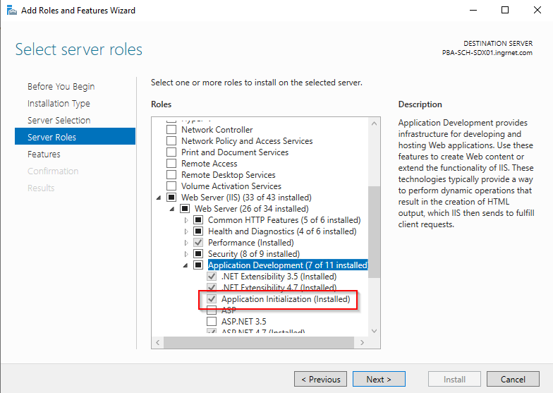

## Install the Application Initialization



## App Pool Advanced Settings

- Start Mode = AlwaysRunning

## Web Site Advanced Settings

- Preload Enabled

## Web Site SSL Settings

- UnCheck 'Require SSL'

## Web.Config file

```xml
 <system.webServer>
 <rewrite>
    <rules>
        <rule name="No redirect on warmup request (request from localhost with warmup user agent)"
        stopProcessing="true">
            <match url=".*" />
            <conditions>
                <add input="{HTTP_HOST}" pattern="<hostname>" />
                <add input="{HTTP_USER_AGENT}" pattern="Initialization" />
            </conditions>
            <action type="Rewrite" url="{URL}" />
        </rule>
        <rule name="HTTP to HTTPS redirect for all requests" stopProcessing="true">
            <match url="(.*)" />
            <conditions>
                <add input="{HTTPS}" pattern="off" />
            </conditions>
            <action type="Redirect" url="https://{HTTP_HOST}/{R:1}" />
        </rule>
    </rules>
</rewrite>
    <applicationInitialization
      doAppInitAfterRestart="true"
      skipManagedModules="true"
      remapManagedRequestsTo="filename.htm">
      <add initializationPage="/Start.aspx" hostName="<hostname>"/>
   </applicationInitialization>
 </system.webServer>
```
